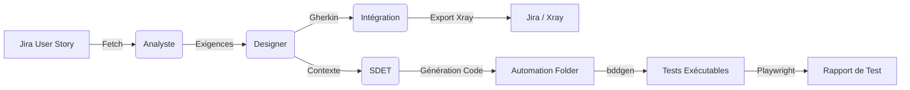

# 🚀 QA Labo IA : L'Ère de l'Assurance Qualité Autonome

Bienvenue dans la présentation du **QA Labo IA**, un framework nouvelle génération conçu pour transformer les spécifications fonctionnelles en tests automatisés robustes, sans intervention humaine majeure.

---

## 🎯 La Vision
Passer du *"Code First"* au **"Story First"**.
L'objectif n'est pas seulement d'aider le QA, mais de créer une **Force de Travail Numérique** (Digital Workforce) capable de :
1.  **Comprendre** le métier (User Story).
2.  **Concevoir** la stratégie de test (BDD).
3.  **Coder** l'automatisation (Playwright).
4.  **Documenter** et tracer les résultats (Jira/Xray).

---

## 🧠 L'Architecture : Système Multi-Agents (CrewAI)

Le cœur du système repose sur une **équipe d'agents IA spécialisés** qui collaborent séquentiellement, mimant une véritable équipe agile.

### L'Équipe Virtuelle
1.  **🕵️‍♂️ L'Analyste (Business Analyst)** :
    *   *Rôle* : Lit le ticket Jira, détecte les ambiguïtés, extrait les Règles de Gestion (RG).
    *   *Livrable* : Analyse structurée des exigences.

2.  **🎨 Le Designer (QA Engineer)** :
    *   *Rôle* : Transforme les RG en scénarios **Gherkin** (Given/When/Then).
    *   *Expertise* : Couverture des cas passants, cas d'échec et cas limites (Edge Cases).

3.  **🔗 L'Agent d'Intégration (Connector)** :
    *   *Rôle* : Parle aux outils externes.
    *   *Actions* : Fetch Jira, Push Xray (Test Set, Pre-Condition).

4.  **💻 Le Développeur SDET (Software Development Engineer in Test)** :
    *   *Rôle* : Transforme le Gherkin en code **Playwright BDD**.
    *   *Livrable* : Feature Files, Step Definitions (.ts) et Page Objects (POM).

5.  **👮‍♂️ Le Superviseur (QA Lead)** :
    *   *Rôle* : Vérifie la cohérence globale et la qualité du code produit avant validation.

---

## 🔄 Le Workflow Unifié

Le flux est entièrement automatisé de la définition du besoin à l'exécution du test.

---

## 🛠️ Stack Technique

Une alliance entre l'IA Générative et l'Ingénierie Logicielle rigoureuse.

*   **Orchestration** : `CrewAI` (Framework Agentique).
*   **Intelligence** : `Google Gemini 1.5 Flash` (LLM rapide et performant).
*   **Intégration** : `Jira Cloud` & `Xray Test Management`.
*   **Automation** :
    *   `Playwright` (Moteur de test E2E moderne).
    *   `Playwright-BDD` (Pont Gherkin <-> TypeScript).
    *   `Node.js` / `Python`.

---

## 🔍 Deep Dive : Comment ça marche ? (Sous le capot)

Voici le détail étape par étape du traitement d'une User Story.

### Phase 1 : L'Intelligence (CrewAI)

1.  **Ingestion (Input)**
    *   Le système reçoit une clé Jira (ex: `SCRUM-8`).
    *   L'**Agent Intégration** interroge l'API Jira pour récupérer le titre, la description et les critères d'acceptation.

2.  **Analyse & Raffinement (Analyste)**
    *   L'IA "lit" la User Story comme un humain.
    *   Elle extrait les Règles de Gestion implicites (ex: "Si le stock est < 0, afficher erreur").
    *   *Output* : Un document d'analyse structuré.

3.  **Conception BDD (Designer)**
    *   L'IA transforme les règles en scénarios Gherkin `Given / When / Then`.
    *   Elle applique les tags `@SCRUM-8` pour la traçabilité.
    *   *Output* : Texte Gherkin validé.

4.  **Synchronisation Xray (Intégration+Tool)**
    *   Le Gherkin est envoyé à Xray Cloud.
    *   **Intelligence** : Le système vérifie si un `Test Set` existe pour cette fonctionnalité.
    *   **Linking** : Il crée les tests, lie les `Pre-Condition` (Background) et regroupe tout dans le `Test Set`.

5.  **Génération Technique (SDET)**
    *   L'IA ne génère pas juste du texte, mais une structure JSON stricte (`CodeGenerationOutput`).
    *   Elle produit 3 fichiers distincts pour respecter les bonnes pratiques :
        *   `.feature` : Le contrat métier.
        *   `.page.ts` : L'objet Page (POM) qui contient les sélecteurs.
        *   `.steps.ts` : La glu technique qui map le Français vers le Code.

### Phase 2 : L'Orchestration Automatique (Python Core)

Une fois que les agents ont fini, le script principal (`main.py`) prend le relais pour "ancrer" le travail dans le réel.

1.  **Matérialisation (File Manager)**
    *   Le script lit le JSON du SDET.
    *   Il écrit physiquement les fichiers dans le dossier `automation/`.
    *   Il crée l'arborescence si elle n'existe pas.

2.  **Compilation BDD (bddgen)**
    *   Lancement de `npx bddgen`.
    *   Cet outil lit les `.feature` et les `.steps.ts`.
    *   Il génère des fichiers de tests Playwright natifs (`.spec.js`) dans un dossier caché `.features-gen`.
    *   *Pourquoi ?* Cela permet de garder les tests maintenables en anglais/français tout en profitant de la puissance pure de Playwright.

3.  **Exécution & Rapport**
    *   Lancement de `npx playwright test`.
    *   Playwright lance les navigateurs (Chromium, Firefox, WebKit).
    *   Il exécute les actions réelles sur l'application (`localhost:3000`).
    *   Il génère un rapport HTML et vidéo (si configuré).

---
 
 ## 🚀 NOUVEAUTÉ : Diagnostic Visuel & Auto-Correction
 
 Le système a franchi une nouvelle étape vers l'autonomie totale grâce à la **Vision par IA** :
 
 *   **Vision-First Debug** : En cas d'échec, le SDET ne se limite plus aux logs texte. Il capture un screenshot et utilise Gemini Vision pour "voir" l'erreur (ex: bouton masqué par une pop-up).
 *   **Auto-Correction Intelligente** : Grâce à la désactivation du cache des outils, l'agent itère en temps réel sur le code jusqu'à la réussite complète du test.
 *   **Analyse Vidéo** : Les enregistrements d'erreurs sont analysés temporellement pour comprendre les bugs de navigation complexes.
 
 ---
 
 ## 🏗️ Ce que le système FAIT pour vous

| Tâche | Avant (Humain) | Après (QA Labo IA) |
| :--- | :--- | :--- |
| **Lecture US** | 30 min de lecture/réunion | **30 secondes** (API Jira) |
| **Écriture Gherkin** | 1h de rédaction manuelle | **1 minute** (Génération Agent) |
| **Création Tickets Xray** | 20 min de clics dans Jira | **Automatique** (API Xray) |
| **Code Automation** | 4h de dev TypeScript | **2 minutes** (Génération SDET) |
| **Exécution** | Lancement manuel | **Automatique** (Pipeline) |

C'est un **Accélérateur de Vélocité** qui permet au QA de se concentrer sur la stratégie complexe et l'exploratoire, plutôt que sur la rédaction de boilerplate.

---
