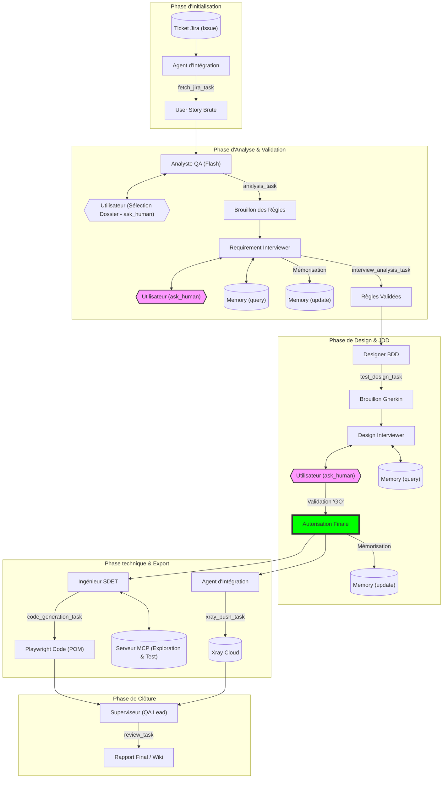

# Schéma du Workflow des Agents et Tâches

Ce schéma illustre le cycle de vie complet d'une User Story, de sa récupération dans Jira jusqu'à sa validation finale et son automatisation.

## Légende
- **Rectangles** : Agents CrewAI.
- **Flèches avec texte** : Tâches (`Task`) spécifiques.
- **Formes violettes** : Points d'interaction humaine (`ask_human`).
- **Formes vertes** : Porte de validation critique ("GO" Gate).
- **Cylindres** : Stockage de données (Jira, Xray, Memory).
